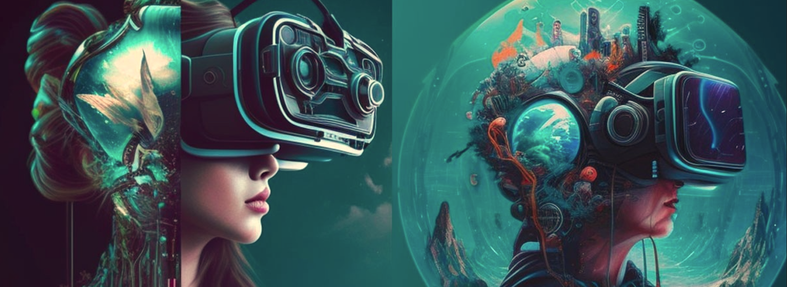

## Hi there I am Aimilios 👋

## About me:

"Lorem ipsum dolor sit amet, consectetur adipiscing elit, sed do eiusmod tempor incididunt ut labore et dolore magna aliqua. Ut enim ad minim veniam, quis nostrud exercitation ullamco laboris nisi ut aliquip ex ea commodo consequat. Duis aute irure dolor in reprehenderit in voluptate velit esse cillum dolore eu fugiat nulla pariatur. Excepteur sint occaecat cupidatat non proident, sunt in culpa qui officia deserunt mollit anim id est laborum."

## Resume

### Qualifications (Education):
- 🥼 PhD Computing (University of Central Lancashire, 2021-Present)
- 🎓 BSc (Hons) Computing (UCLan Cyprus, 2021)

### Specialization and Research Interest:
-	🤖 Pedagogical Agents and Agent Technologies
-	🕹️ Games Development and Evaluations
-	📱 Applications of Immersive Technologies (VR/AR/MR)
-	🥽 Immersive and Educational Technologies
-	👾 Serious Games and Game-Based Learning
-	🔎 Applications and Evaluation of Virtual Worlds
-	👨‍💻 Human-Computer Interactions

### Employment Track:
-	🎮 Game Studio Manager - **Rays and Vectors Student-led Game Studio** (2022-Present)
-	🔎 Research Associate - **UCLan Cyprus** (2021-Present)
-	👨‍💻 Co-Founder, Media Director and Editor - **Business Status Blog** (2021-Present)
-	🥼 Student Researcher - **INSPIRE Lab** (2021) 

### Publications:
- 📚 **Scientific Posters:**
  - Hadjiliasi A., Nisiotis L., and Polycarpou I. (2022) – Utilising Pedagogical Agents and Virtual Reality as a unified technology to support immersive learning [Poster] at the 2nd IEEE International Conference on Intelligent Reality (ICIR 2022) conference.
  - Hadjiliasi A., Nisiotis L., and Polycarpou I. (2022) – Utilising Pedagogical Agents and Virtual Reality as a unified technology to support immersive learning [Poster] at the 9th ACM Celebration of Women in Computing: womENcourage 2022 celebration.
- 📚 **Conference Papers:**
  - Hadjiliasi A., Nisiotis L. and Polycarpou I. (2024) A Comparative Assessment of Technology Acceptance and Learning Outcomes in Computer-based versus VR-based Pedagogical Agents. In: 23rd IEEE International Symposium on Mixed and Augmented Reality (ISMAR), 21-25/10/2024, Seattle, WA, USA.
  - Nisiotis, L. and Hadjiliasi, A., 2023. Work-in-progress—assessing the feasibility of playtesting video games using immersive technologies as a learning method. Immersive Learning Research-Academic, pp.24-28. doi: https://doi.org/10.56198/ZH3JOITAS
- 📚 **Book Chapters:**
  - Nisiotis L., Hadjiliasi A., Alexandrou F. and Alboul L. (2023) Interwoven Spaces with XR, AI and Robots: Merging Realities in Space and Time. In: Museums and Technologies of Presence. Routledge. ISBN 9781003334316

### Memberships (Academic/Professional):
-	📀 Institute of Electrical and Electronics Engineering (IEEE)

### Teaching Roles and Academic Responsibilities (Including past roles and responsibilities):
- **UCLan Cyprus (2021-Present):**
  - 👨🏼‍🏫 **Teaching, Lab Instruction and Course Leadership:**
      - CO1301 – Game Concepts (2021-2025) – Lab Instructor
      - CO3519 – Artificial Intelligence (2022-2023) - Lab Instructor
      - CO1406 – Algorithms and Data Structures (2023-2025) - Lab Instructor
      - CO3808 – Double Project (2022-2025) – BSc final year (thesis) Project Supervisor
  - 👨🏼‍💼 **Administrative Roles:**
    - Game Studio Manager – Rays and Vectors student-led game studio (2022-Present)

### Scholarships and Awards:
- 🏵️ **Scholarships:**
  - 2021-2024: UCLan 100% Scholarship for 3 years toward a PhD in Computing
  - 2017-2021: UCLan Cyprus 50% Scholarship for 4 years toward a BSc (Hons) in Computing
- 🏵️ **Awards:**
  - 2022 – Coached the Winning UCLan Cyprus team of the Pancyprian Game Development Challenge competition
  - 2021 – Dean List Award – for graduating with first-class honours
  - 2021- 2nd place award – IEEE ACIR/ICIR competition – for the development of an intelligent VR museum to support cultural heritage and enhance user experience

### Other Scholarly and Outreach Activities:
- 📗 **Mentor and Judge**, Logipegnion Game Development Competition (2021-2022)
- 📘 **Conference and Events Volunteer:**
    - IEEE Future Tech Forum Roundtable – User Adoption of the Metaverse (2023)
    - 9th ACM womENcourage celebration (2022)
    - 2nd IEEE ICIR Conference (2022)
- 📙 **Conference Paper - Peer Reviewer:**
  - IEEE International Symposium of Emerging Metaverse 2024 (ISEMV2024)

  
### Connect with me:

   
  
  
  
  
  

